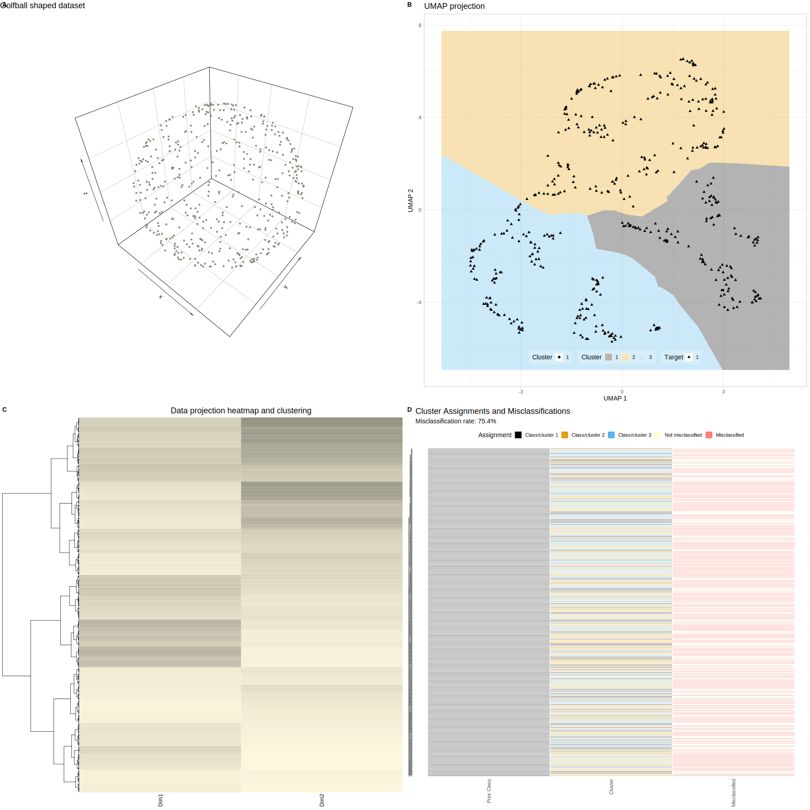

# UMAP Ward Misclassification Analysis

## When Artifacts Masquerade as Discovery: An Investigative Quality Control Framework for Lipidomics

This repository provides an **investigative quality control (QC) framework for omics data** designed to detect hidden laboratory artifacts and batch effects that may masquerade as biological signals. The method combines UMAP projection, Ward's hierarchical clustering, Voronoi cell visualization, and supervised classification (Random Forest) to systematically identify misclassified or anomalously clustered samples.

### Core Framework

The quality control workflow:
1. **Unsupervised structure detection**: UMAP projection + Ward clustering + Voronoi visualization to identify potential subgroups and anomalies
2. **Supervised artifact detection**: Random Forest classification across multiple alternative class structures (batches, processing dates, derived clusters) to test whether data structure supports the biological hypothesis or reveals technical confounds
3. **Evidence-based interpretation**: When supervised classifiers achieve higher accuracy for workflow-related groupings than for the biological hypothesis, this signals that technical artifacts may dominate the biological signal, requiring investigation before biological interpretation

### Intended Use

This framework complements existing omics QC pipelines by providing **post-analysis detective work** when standard QC, statistical analysis, and machine learning all appear to validate a biological hypothesis, yet the results seem suspiciously perfect or inconsistent with prior knowledge. It is particularly useful for:
- Identifying unexpected batch effects that escape standard QC procedures
- Flagging samples that cluster anomalously
- Testing multiple alternative explanations for observed data structure
- Validating whether apparent biological signals are robust or artifacts

**Important**: This is a framework for investigation and hypothesis testing, not a replacement for standard data preprocessing and quality control.

## Installation

Download this code repository to the local hard drive. All required R packages will be automatically installed and loaded when you run the example scripts. 

## Package Architecture

The code is organized in a modular hierarchy:

```
Example Scripts (*_run.R)
    ↓
Core Analysis Functions (umap_ward_misclassification_analysis*.R)
    ↓
Utility Functions (prepare_dataset.R, perform_*.R, plot_*.R)
```

### Utility Functions and Libraries

The core computational functions automatically load their required libraries:

- **`prepare_dataset.R`**: Data standardization and preprocessing
- **`perform_umap_projection.R`**: UMAP dimensionality reduction (requires: `umap`)
- **`perform_ward_clustering.R`**: Hierarchical clustering with optimization (requires: `stats::hclust`, `clue::solve_LSAP`)
- **`plot_umap_with_voronoi.R`**: Voronoi tessellation visualization (requires: `ggplot2`, `ggrepel`, `deldir`)
- **`plot_misclassification_heatmap.R`**: Misclassification heatmap visualization (requires: `ggplot2`, `tidyr`, `scales`)
- **`plot_classification_stability_heatmap.R`**: Classification stability visualization (requires: `ggplot2`, `tidyr`, `scales`, `grid`)

### Core Method Functions

#### `umap_ward_misclassification_analysis()` — **Main QC Framework Function**
**Description**: Combines UMAP projection, Ward hierarchical clustering, Voronoi visualization, and misclassification analysis to detect anomalous samples and data structure inconsistent with the study hypothesis.

**Key Parameters**:
- `data`: Input data (samples × features)
- `target`: Target class labels for comparison
- `output_dir`: Directory for output files
- `file_format`: "svg" or "png"
- `n_neighbors`: UMAP parameter (default: 15)

**Output Files**:
- `{file_prefix}_voronoi.{format}`: UMAP + Voronoi visualization
- `{file_prefix}_heatmap.{format}`: Misclassification heatmap
- `{file_prefix}_combined.{format}`: Combined visualization
- `{file_prefix}_misclassified_samples.csv`: Anomalous samples (if any)

#### `perform_supervised_classification()` — **Artifact Detection via Random Forest**
**Description**: Tests multiple hypotheses using **Random Forest and SVM** classifiers with hyperparameter tuning, comparing classification accuracy across biological targets vs. technical groupings (batches, dates, derived clusters).

**Key Parameters**:
- `X`: Predictor features
- `Y`: Target variables to test (alternative hypotheses)
- `n_iter`: Resampling iterations (paper uses 100)
- `training_size`: Train/test ratio (default: 0.67)

**Returns**: Median balanced accuracy with 95% CI for each hypothesis tested.

### Supplementary Functions

**`umap_ward_misclassification_analysis_multi()`**: Optional multi-target extension. **`plot_classification_stability_heatmap()`**: Optional visualization of classification stability.

## Usage Examples

### Basic Usage with Sample Data

``` r
# Load the data
lipid_profiles <- read.csv("lipid_profiles.csv")
sample_metadata <- read.csv("sample_metadata.csv")
sample_types <- sample_metadata$SampleType

# Run the analysis
results <- umap_ward_misclassification_analysis(
  data = lipid_profiles,
  target = sample_types,
  labels = sample_metadata$SampleID,
  output_dir = "qc_results",
  file_prefix = "lipid_analysis",
  file_format = "png",
  width = 14,
  height = 10
)

# Check misclassification rate
cat("Misclassification rate:", 
    sprintf("%.2f%%", results$misclassification_rate * 100), "\n")

# View misclassified samples
if (nrow(results$misclassified_samples) > 0) {
  print(results$misclassified_samples)
}
```

## Example Scripts

This repository includes example R scripts implementing the analyses described in the paper:

### Publication Case Study
Case study on real lipidomics data (PsA patients vs. controls) demonstrating detection of a hidden batch effect. Shows:
- UMAP projection with Voronoi tessellation visualization  
- Ward hierarchical clustering
- Identification of misclassified/anomalous samples
- Random Forest supervised classification testing alternative hypotheses (study groups, derived clusters, batch identifiers, processing dates)
- How supervised classifiers revealed that batch effects (not biological differences) dominated the signal
- **Variable importance analysis** with recursive cABC selection and top-N feature extraction
- **Hyperparameter tuning** for both Random Forest (`mtry`, `ntree`) and SVM (`C`, `sigma`)

This script reproduces the primary case study described in the paper.

### Method Validation

**`lipid_validation_data_run.R`**: Comprehensive validation of the QC framework on independent data with artificial bias tests:
- **Unsupervised analysis with artificial bias**: UMAP + Ward clustering + Voronoi tessellation applied to reference data with and without artificially injected batch effects
  - Original data (unbiased)
  - Biased data (PLATE 1 samples increased by configurable percentage)
- **Supervised classification with artificial bias and permutation tests**: Random Forest classification testing sensitivity to bias across multiple conditions:
  - Real data with original labels
  - Real data with artificially injected bias
  - Permuted feature data (null model) for statistical validation
  - Permuted feature data with artificial bias (null model control)
- Demonstrates sensitivity and specificity of the framework for detecting batch effects of configurable magnitude

### Demonstration Examples

**`golfball_dataset_run.R`**: Artificial "golfball" dataset (concentric spheres) demonstrating the visualization approach on synthetic data with known structure. Useful for understanding how the method behaves when data structure is completely understood. The output includes a combined visualization (`golfballs_combined_plot.svg`) showing:
- **Left panel**: UMAP projection with Voronoi tessellation colored by cluster assignments (for Voronoi tesselation plot, cite Jorn Lotsch and Dario Kringel (2026). Voronoi tessellation as a complement or replacement for confidence ellipses in the visualization of data projection and clustering results. PLoS One (in revision))
- **Right panel**: Misclassification heatmap comparing prior class assignments (spheres) with Ward-assigned clusters



**`example_run.R`**: Simplified introductory example showing basic workflow with minimal configuration. Ideal for learning the core approach before applying to real data.

**`create_sample_files.R`**: Generates synthetic lipidomics data for quick testing and learning purposes.

## Dependencies

### Core Analysis
All required packages are automatically installed and loaded:
- **Visualization**: `ggplot2`, `ggrepel`, `deldir` (Voronoi), `gridExtra`
- **Analysis**: `umap`, `clue` (Hungarian algorithm)
- **Utilities**: `tidyr`, `scales`, `grid`

### Supervised Classification (Random Forest + SVM)
- `caret`, `randomForest`, **SVM (svmRadial)**, `parallel`, `pbmcapply`, `caTools`, `dplyr`
- Hyperparameter tuning with cross-validated grids (`mtry`, `ntree`, `C`, `sigma`)

### Demonstrations (Golfball, Visuals)
- `ComplexHeatmap`, `cowplot`, `plot3D`, `car`, `ggplotify`

### Variable Importance & Feature Selection
- `cABCanalysis`, `twosamples`, `matrixStats` (recursive ABC analysis)


### System Requirements

- **R version**: 4.0 or higher (recommended 4.3+)
- **Operating System**: Linux or Unix (macOS supported); **not tested on Windows**
- **RAM**: Minimum 4GB (8GB+ recommended for large datasets)
- **Processing**: Parallel processing recommended; CPU cores utilized: 4-8

## License

CC-BY 4.0

## Citation

If you use this code/concept/tool in your work, please cite:

Lötsch J, Hahnefeld L, Geisslinger G, Himmelspach A, and Kringel D. When artifacts masquerade as discovery: An investigative quality control framework for lipidomics. *2026* (in preparation).